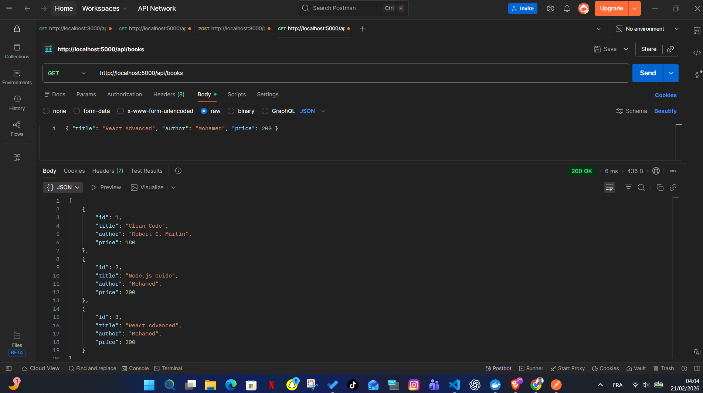
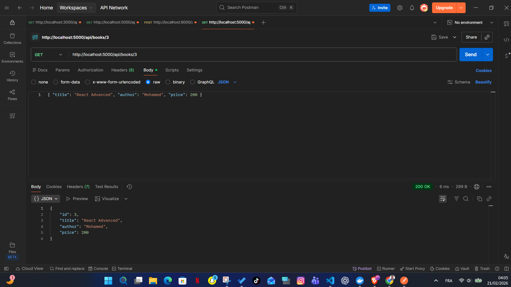
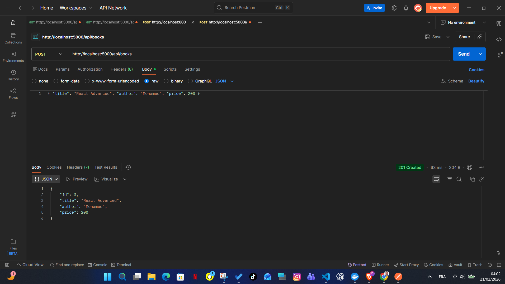
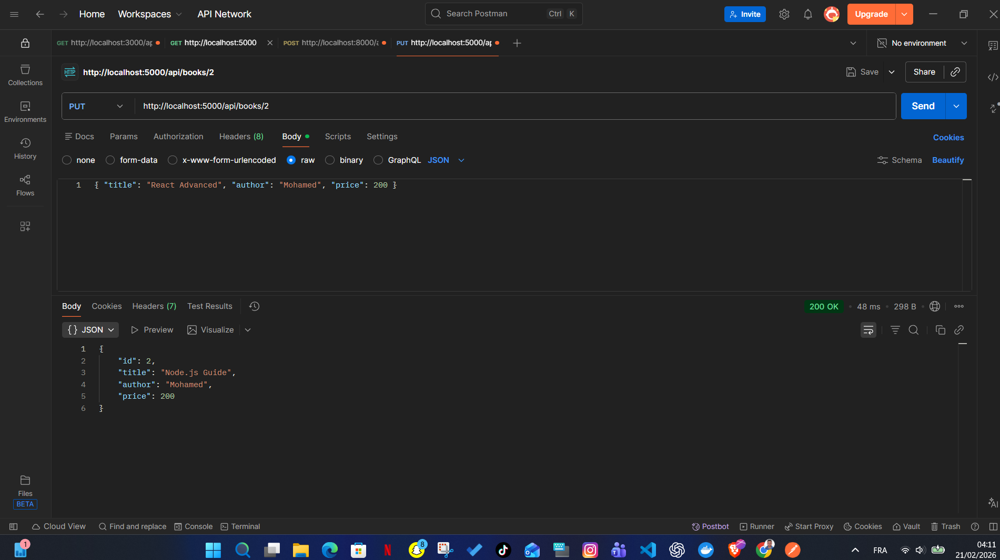
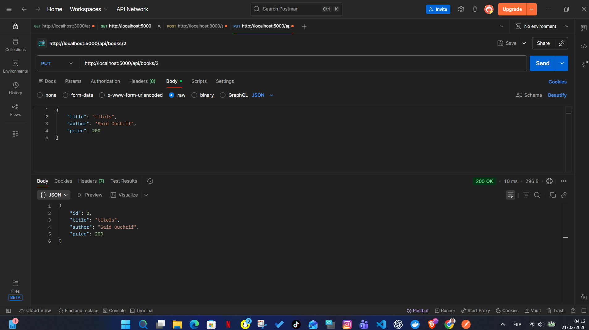
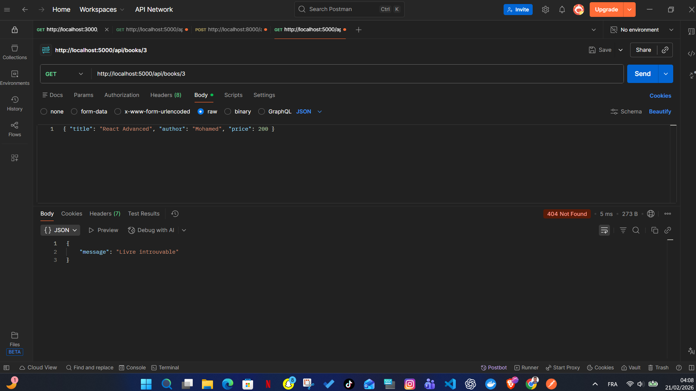

# Express Systeme Gestion Bibliotheque

API REST simple de gestion de bibliotheque construite avec **Node.js** et **Express.js**.
Le projet suit une architecture claire en couches:

- `Routes/` pour definir les endpoints
- `Controllers/` pour gerer la logique metier
- `server.js` pour configurer et lancer le serveur

Ce projet est ideal pour apprendre les bases de:

- Express
- routage REST
- manipulation de donnees JSON
- organisation d'un backend modulaire

## Fonctionnalites

- Recuperer tous les livres
- Recuperer un livre par ID
- Ajouter un nouveau livre
- Mettre a jour un livre existant
- Supprimer un livre par ID
- Retourner des messages d'erreur explicites (404, 400)

## Technologies

- Node.js
- Express.js
- dotenv
- Nodemon (developpement)

## Structure du projet

```text
express-systeme-gestion-bibliotheque/
|-- Controllers/
|   `-- BookController.js
|-- Routes/
|   `-- BookRoutes.js
|-- images/
|   |-- ajouter_book.png
|   |-- avant_update.png
|   |-- apres_update.png
|   |-- delete_book_id.png
|   |-- get_book.png
|   |-- get_book_id.png
|   `-- get_book_apres_delete.png
|-- .env
|-- package.json
|-- README.md
`-- server.js
```

## Installation et lancement

1. Cloner le projet:

```bash
git clone https://github.com/Saidouchrif/express-systeme-gestion-bibliotheque.git
cd express-systeme-gestion-bibliotheque
```

2. Installer les dependances:

```bash
npm install
```

3. Configurer les variables d'environnement (`.env`):

```env
PORT=5000
APP_NAME=GestionBibliothequeAPI
```

4. Lancer le serveur:

```bash
npm run dev
```

ou en mode normal:

```bash
npm start
```

Serveur disponible sur:

```text
http://localhost:5000
```

## Endpoints API

Base URL:

```text
http://localhost:5000/api/books
```

### 1) GET /api/books
Recupere la liste de tous les livres.

- Reponse succes: `200 OK`

Exemple de reponse:

```json
[
  {
    "id": 1,
    "title": "Clean Code",
    "author": "Robert C. Martin",
    "price": 180
  },
  {
    "id": 2,
    "title": "Node.js Guide",
    "author": "Mohamed",
    "price": 200
  }
]
```

### 2) GET /api/books/:id
Recupere un livre par son identifiant.

- Reponse succes: `200 OK`
- Si non trouve: `404 Not Found`

Exemple de reponse erreur:

```json
{
  "message": "Livre introuvable"
}
```

### 3) POST /api/books
Ajoute un nouveau livre.

- Reponse succes: `201 Created`
- Champs obligatoires: `title`, `author`, `price`
- Si champs manquants: `400 Bad Request`

Exemple de body:

```json
{
  "title": "React Advanced",
  "author": "Mohamed",
  "price": 200
}
```

Exemple de reponse:

```json
{
  "id": 3,
  "title": "React Advanced",
  "author": "Mohamed",
  "price": 200
}
```

### 4) PUT /api/books/:id
Met a jour un livre existant.

- Reponse succes: `200 OK`
- Si non trouve: `404 Not Found`

Exemple de body:

```json
{
  "title": "Titels",
  "author": "Said Ouchrif",
  "price": 200
}
```

### 5) DELETE /api/books/:id
Supprime un livre par ID.

- Reponse succes: `200 OK`
- Si non trouve: `404 Not Found`

Exemple de reponse:

```json
{
  "message": "Livre supprime avec succes"
}
```

## Scenarios de test Postman (avec images)

### Test 1 - Recuperer tous les livres (`GET /api/books`)
Cette capture montre l'appel de la route qui retourne toute la collection de livres.
Le serveur repond `200 OK` avec un tableau JSON.



### Test 2 - Recuperer un livre par ID (`GET /api/books/3`)
Cette capture montre la recuperation d'un livre specifique.
Le serveur repond `200 OK` avec l'objet du livre (id, title, author, price).



### Test 3 - Ajouter un livre (`POST /api/books`)
Cette capture montre l'envoi d'un body JSON pour creer un nouveau livre.
Le serveur repond `201 Created` avec le livre cree et son `id`.



### Test 4 - Etat avant mise a jour (`avant_update`)
Cette capture represente l'etat initial d'un livre avant l'operation de mise a jour.
Elle sert de reference pour comparer les changements apres le `PUT`.



### Test 5 - Mise a jour d'un livre (`PUT /api/books/2`)
Cette capture montre la requete `PUT` avec un body JSON pour modifier un livre.
Le serveur repond `200 OK` avec la ressource retournee apres traitement.



### Test 6 - Supprimer un livre (`DELETE /api/books/3`)
Cette capture montre la suppression d'un livre par son ID.
Le serveur repond `200 OK` avec un message de confirmation.


### Test 7 - Verification apres suppression (`GET /api/books/3`)
Cette capture valide qu'apres suppression, le livre n'existe plus.
Le serveur repond `404 Not Found` avec le message `Livre introuvable`.



## Limites actuelles

- Les donnees sont stockees en memoire (tableau `books`) et se reinitialisent au redemarrage.
- Pas de base de donnees persistante pour le moment.
- Pas d'authentification.

## Pistes d'amelioration

- Ajouter MongoDB ou PostgreSQL
- Ajouter validation avancee (Joi, Zod)
- Ajouter une gestion centralisee des erreurs
- Ajouter des tests automatises (Jest + Supertest)
- Ajouter Swagger/OpenAPI pour documenter automatiquement l'API
